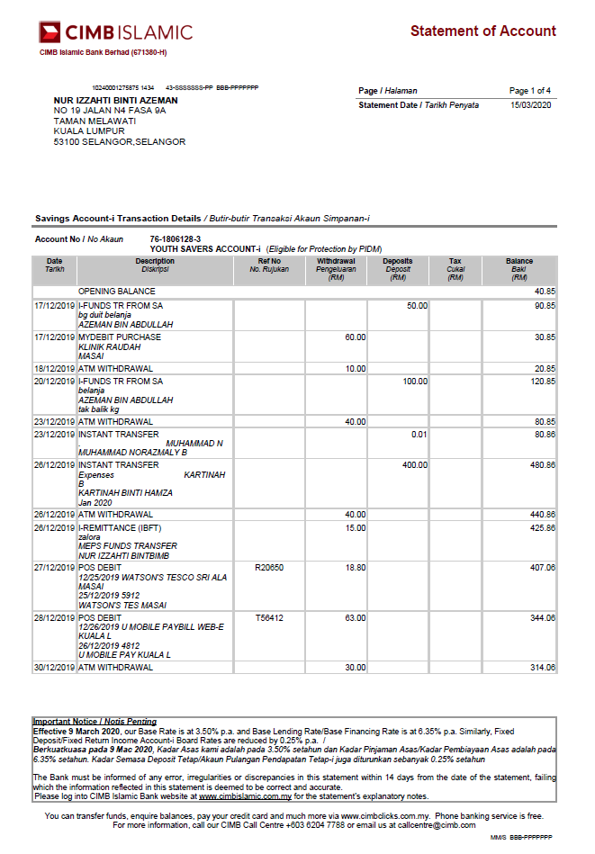
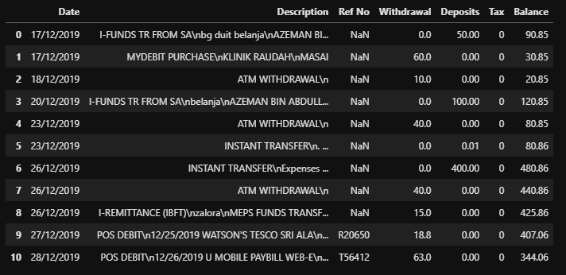

# Bank Statement Digitization
Optical character recognition (OCR) is a subset of machine vision technology that focuses on recognizing written letters and characters and reproducing them digitally for later use. This opens up many possibilities for banking industry, including security solutions, and document digitization. In this project, we parsed the transactions in bank statements from PDF files into excel files using Camelot library. Also, we added other important informations from the documents using Tensorflow Object Detection API and Google Tesseract.

## How to use this repository?
### <b>a) Create a virtual environment using anaconda</b>
  - Install python 3.7

### <b>b) Check your computer's CUDA driver version.</b>
  - We used CUDA 11.2 and it is only compatible with Tensorflow 2.5.0
  - Please make sure you install the correct CUDA, & CUDNN for your machine with the correct Tensorflow version
  - Refer this table for confirmation https://www.tensorflow.org/install/source#gpu
  
### <b>c) Open the train directory and clone the labelImg repository</b>
  - git clone https://github.com/tzutalin/labelImg.git
  
### <b>d) Open the train directory and clone the tensorflow/models repository</b>
  - git clone https://github.com/tensorflow/models.git
  
### <b>e) Install dependencies</b>
  - conda install cudatoolkit
  - pip install -r 'requirements.txt'

### <b>f) Put the bank statements dataset in the train/raw_dataset directory</b>
  - Ensure the PDF files are all text based
  
### <b>g) Run the scripts in sequence</b>
  - Before running the scripts, ensure that all paths are correctly defined
    - Run preprocess.py
    - Run label.py
    - Run augment.py
    - Run split.py
    - Run create_csv.py
    - Run create_tf_records.py
    - Run download_model.py
    - Run configure.py
    - Run train.py
    - Run valid.py
    - Run tensorboard.py
    - Run test.py
    - Run pdf_extract.py
    - Run extract_metadata.py

### <b>h) Example of prediction input</b>

### <b>i) Example of prediction output</b>

